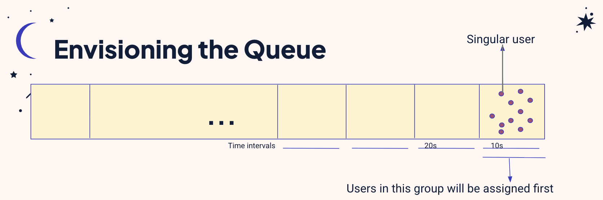

# BookTessera

This was a project I worked on with my friends — Sophie, Shreya, Alex, and Naimisha.

We never ended up deploying it, but it’s still one of the more interesting systems I’ve worked on. It forced us to think about fairness, scale, and what it actually means to “get a ticket” when demand is high.

---

## where the name came from

A *tessera*, in Latin, means a token or ticket — something that granted access. For example:

* **tessera frumentaria** → a token for receiving grain
* **tessera theatralis** → a ticket for theater admission

So not a reservation system in the modern sense, but more like *proof that you’re allowed in*.

That idea stuck with us — BookTessera became a system about issuing access fairly.

---

## the problem

Ticketing systems break under pressure.

When a popular event drops:

* everyone shows up at once
* servers get overwhelmed
* bots and fast connections win
* “first come, first serve” stops being fair

We wanted to design something that felt **fair**, even under heavy load.

---

## the core idea: rethink the queue

The most interesting part of BookTessera was the queue.

Instead of a strict first-come-first-serve system, we experimented with a **time-based priority queue + clustering** approach.

### high-level idea

1. Users join a queue within a time window
2. Instead of exact ordering, we group users into *time buckets*
3. Within each bucket, users are treated roughly equally
4. Buckets are processed in order

This softens the advantage of being milliseconds faster than someone else.

---

## queue design (simplified)

```
[ users arrive ]
        ↓
[ assign timestamp ]
        ↓
[ group into time windows ]
        ↓
[ cluster users (K-means) ]
        ↓
[ process clusters in order ]
        ↓
[ issue tickets ]
```


### why clustering?

We used K-means (a bit experimental, honestly) to group users within time ranges.

The goal wasn’t perfect clustering — it was to:

* smooth out spikes
* prevent microsecond-level advantages
* keep the system manageable under load

In practice, it became a tradeoff:

* **strict ordering** → more “accurate,” less fair under load
* **clustering** → more fair, less precise

---

## tech stack

We built this as a full-stack app:

* **frontend:** React
* **backend:** Flask
* **queue logic:** custom priority + clustering system
* **data handling:** timestamp-based grouping + K-means

Nothing too fancy individually, but the system design was where most of the thinking went.

---

## UI (very quick look)

We also built out a simple UI for:

* joining the queue
* seeing your position/status
* eventually claiming tickets

*(insert screenshots here)*

It wasn’t polished, but it made the system feel real.

---

## what I learned

A few things stood out from this project:

### 1. fairness is not trivial

“First come, first serve” sounds fair, but breaks quickly in distributed systems.
Network speed, latency, and infrastructure all bias the outcome.

### 2. systems design is mostly tradeoffs

Every improvement came with a cost:

* fairness vs precision
* throughput vs ordering guarantees
* simplicity vs control

There’s no perfect queue — only different compromises.

### 3. you don’t have to ship to learn something real

Even though we never deployed BookTessera, it pushed me to think more deeply about:

* queues under load
* real-world constraints
* designing for humans, not just correctness

---

## closing

BookTessera started as a simple idea: *what if getting a ticket felt fair?*

We didn’t fully solve it, but we built something that explored the space in a meaningful way.

And honestly, that was enough.
